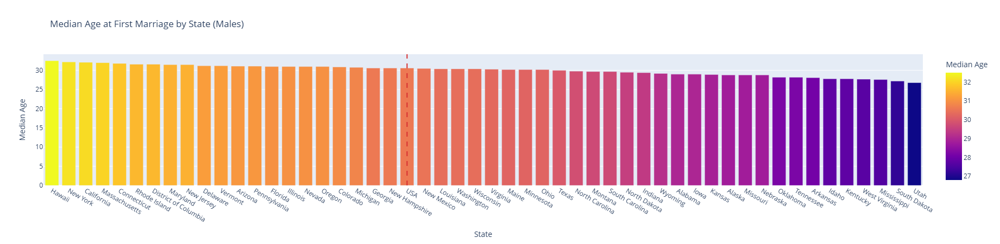
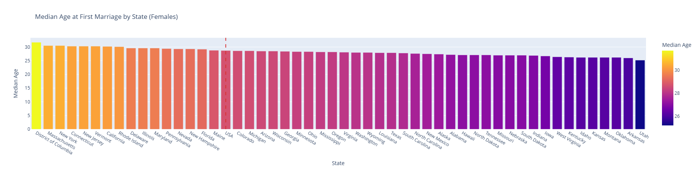
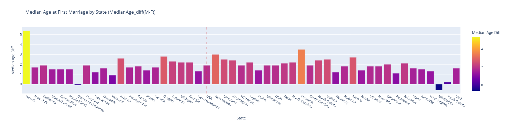
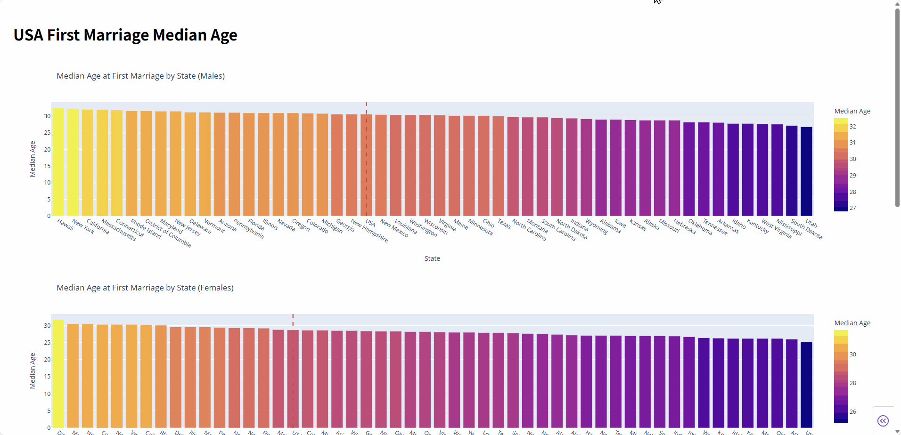

# USA-FirstMarriage

usa first marriage median age data visualization by plotly

Data Source: [Median Age at First Marriage: Geographic Variation](https://www.bgsu.edu/ncfmr/resources/data/family-profiles/FP-25-09.html)

## [Notebook](USA-FirstMarriage.ipynb)





## [Dash APP](dash.py)

run

```
pip install -r requirements.txt

python app.py
```



### reference

[plotly choropleth](https://plotly.com/python/tile-county-choropleth/)
